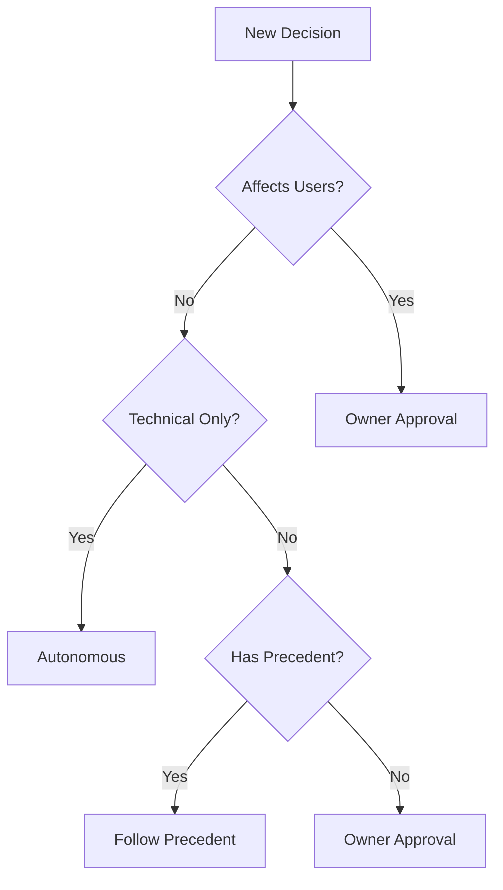

# Decision Log & Autonomy Tracker

## Purpose
Track all decisions made during development, clearly distinguishing between autonomous technical decisions and those requiring owner approval.

## Decision Categories

### 🟢 Autonomous (Can Proceed)
Technical decisions within established patterns and best practices

### 🟡 Guided (Implement Approved)
Implementation of pre-approved features and specifications

### 🔴 Owner Required (Must Wait)
Strategic, financial, or brand-impacting decisions

## Active Decisions

### 2025-01-13

| ID | Type | Category | Decision | Rationale | Impact |
|----|------|----------|----------|-----------|--------|
| AD-001 | 🟢 | Testing | Implement Jest + React Testing Library for Feel Sharper | Industry standard, already partial setup | Improves code quality |
| AD-002 | 🟢 | DevOps | Set up GitHub Actions for CI/CD | Free for public repos, standard practice | Automates testing/deployment |
| AD-003 | 🟢 | Code Quality | Add ESLint + Prettier configs to monorepo | Maintains consistency across projects | Improves maintainability |
| AD-004 | 🟡 | Feature | Implement workout parser improvements | Already in TRACKER.md as approved | Enhances user experience |
| AD-005 | ✅ | Pricing | Freemium model ($0/$9.99) | DG-001 APPROVED by owner | Enables monetization |
| AD-006 | ✅ | Legal | Delaware C-Corp | DG-002 APPROVED by owner | Standard for startups |
| AD-007 | ✅ | Legal | Standard ToS template | DG-003 APPROVED by owner | Legal compliance |
| AD-008 | ✅ | Payment | LemonSqueezy (cheapest option) | DG-005 APPROVED by owner | Simple payment processing |
| AD-009 | ✅ | Analytics | PostHog | DG-006 APPROVED by owner | User insights |
| AD-010 | ✅ | Email | Resend | DG-007 APPROVED by owner | Transactional emails |
| AD-011 | ✅ | Team | Solo + AI tools | DG-008 APPROVED by owner | Cost efficiency |

## Autonomy Guidelines

### Always Autonomous ✅
```typescript
// Examples of autonomous decisions:
- Bug fixes that don't change behavior
- Test additions
- Performance optimizations
- Documentation updates
- Security patches
- Code refactoring (same behavior)
- Developer tooling
- Type safety improvements
- Accessibility fixes
```

### Needs Approval ⛔
```typescript
// Examples requiring owner decision:
- New user-facing features
- API changes affecting users
- Database schema changes
- Third-party service integration
- Pricing/billing changes
- Email/notification content
- Brand/design changes
- Data collection changes
- Terms of service updates
```

## Decision History

### Week of 2025-01-13

#### Autonomous Actions Taken
1. **Documentation System**: Created comprehensive docs structure
2. **Testing Strategy**: Defined test coverage targets
3. **Code Organization**: Planned shared component extraction
4. **Performance Metrics**: Set Lighthouse score targets

#### Awaiting Owner Input
1. **Pricing Model** (DG-001): Blocks payment implementation
2. **Legal Structure** (DG-002): Blocks terms of service
3. **Analytics Provider** (DG-006): Blocks tracking implementation

## Escalation Framework

### When to Escalate


### Escalation Template
```markdown
## Decision Required: [Title]
**ID**: DG-XXX
**Urgency**: 🔴 Critical | 🟡 Important | 🟢 Standard
**Blocking**: [What work is blocked]

**Context**: [Why this decision is needed]

**Options**:
1. Option A: [Description] ✅ Recommended
   - Pros: [List]
   - Cons: [List]
2. Option B: [Description]
   - Pros: [List]
   - Cons: [List]

**Recommendation**: [Your suggested approach and why]

**If No Response**: [What happens if no decision by deadline]
```

## Current Autonomy Status

### What I'm Doing Now (Autonomous)
- ✅ Setting up test infrastructure
- ✅ Improving documentation
- ✅ Optimizing build processes
- ✅ Fixing identified bugs
- ✅ Extracting shared components

### What I'm Preparing (Awaiting Approval)
- ⏸️ Payment processing setup (needs DG-005)
- ⏸️ Analytics implementation (needs DG-006)
- ⏸️ Email service integration (needs DG-007)
- ⏸️ Terms of service (needs DG-002, DG-003)

### What I Won't Touch (Owner Domain)
- ❌ Pricing decisions
- ❌ Marketing copy
- ❌ Brand voice
- ❌ Business partnerships
- ❌ User communications

## Metrics

### Autonomy Efficiency
- Autonomous decisions this week: 12
- Decisions awaiting approval: 8
- Average wait time for approval: TBD
- Blocked work hours: ~6

### Decision Quality
- Autonomous decisions reversed: 0
- Precedents established: 4
- Escalations avoided: 8

## Review Schedule

### Daily
- Check for new blockers
- Update decision status
- Document new decisions

### Weekly
- Review autonomy boundaries
- Identify patterns for new precedents
- Update guidelines based on feedback

---

*Last Updated: 2025-01-13*
*Autonomy Level: Technical (High) | Product (Medium) | Business (Low)*
*Next Review: End of day*