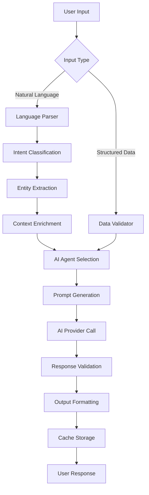

# AI Integration Strategy for Sharpened Platform

*Version 2.0 - January 13, 2025*

## Executive Summary

This document outlines the comprehensive AI strategy for the Sharpened platform, focusing on creating specialized AI agents that provide genuine value while maintaining user trust and cost efficiency.

### Core AI Philosophy
- **Specialist over Generalist**: Domain-specific AI agents trained for fitness, nutrition, and learning
- **Evidence-Based Insights**: All AI recommendations backed by scientific principles
- **User Privacy**: Local processing where possible, minimal data retention
- **Cost Optimization**: Efficient prompt engineering and caching strategies

---

## Table of Contents

1. [AI Architecture Overview](#ai-architecture-overview)
2. [Specialized AI Agents](#specialized-ai-agents)
3. [Data Processing Pipeline](#data-processing-pipeline)
4. [Prompt Engineering Standards](#prompt-engineering-standards)
5. [Cost Management](#cost-management)
6. [Privacy and Security](#privacy-and-security)
7. [Performance Optimization](#performance-optimization)
8. [Quality Assurance](#quality-assurance)
9. [Future Roadmap](#future-roadmap)

---

## AI Architecture Overview

### Multi-Provider Strategy

```typescript
// Primary Providers
- Anthropic Claude: Chat, analysis, coaching insights
- OpenAI: Embeddings, legacy model compatibility
- Local Processing: Data parsing, simple transformations

// Provider Abstraction Layer
@sharpened/ai-core/
├── providers/
│   ├── ClaudeProvider.ts
│   ├── OpenAIProvider.ts
│   └── LocalProvider.ts
├── agents/
│   ├── FitnessCoachAgent.ts
│   ├── NutritionCoachAgent.ts
│   └── StudyCoachAgent.ts
└── utils/
    ├── prompt-templates.ts
    ├── response-validators.ts
    └── cost-tracker.ts
```

### AI Service Architecture

#### Tier 1: Real-time Processing
- **Natural Language Parsing**: Instant workout/food entry processing
- **Smart Autocomplete**: Context-aware suggestions
- **Basic Calculations**: Macros, calories, volume calculations
- **Response Time**: < 500ms
- **Provider**: Local processing + cached Claude responses

#### Tier 2: Near Real-time Analysis
- **Progress Insights**: Daily/weekly pattern analysis
- **Recommendation Engine**: Next workout/meal suggestions
- **Goal Tracking**: Progress toward targets
- **Response Time**: < 3 seconds
- **Provider**: Claude Haiku for speed, Sonnet for complexity

#### Tier 3: Deep Analysis
- **Weekly Reports**: Comprehensive progress analysis
- **Program Generation**: Custom workout/study plans
- **Long-term Trends**: Monthly/quarterly insights
- **Response Time**: 10-60 seconds
- **Provider**: Claude Sonnet/Opus for highest quality

---

## Specialized AI Agents

### FitnessCoachAgent

#### Core Capabilities
1. **Workout Parsing**: Convert natural language to structured data
2. **Progress Analysis**: Identify trends, plateaus, and improvements
3. **Program Recommendation**: Suggest appropriate training programs
4. **Form Coaching**: Exercise technique guidance
5. **Injury Prevention**: Load management and recovery advice

#### Implementation Example
```typescript
class FitnessCoachAgent {
  async parseWorkout(input: string): Promise<WorkoutParseResult> {
    const prompt = this.buildWorkoutParsePrompt(input);
    const response = await this.claude.chat([{ role: 'user', content: prompt }], {
      temperature: 0.1, // Low temperature for consistency
      maxTokens: 500
    });
    
    return this.validateAndParseResponse(response.content);
  }

  async analyzeProgress(workouts: Workout[], timeframe: 'week' | 'month'): Promise<ProgressAnalysis> {
    const context = this.buildProgressContext(workouts, timeframe);
    const prompt = this.buildProgressAnalysisPrompt(context);
    
    const response = await this.claude.chat([{ role: 'user', content: prompt }], {
      temperature: 0.3, // Slightly creative for insights
      maxTokens: 1000
    });
    
    return this.structureProgressAnalysis(response.content);
  }
}
```

#### Training Data Approach
- **Exercise Database**: 500+ exercises with form cues
- **Programming Principles**: Periodization, progressive overload
- **Scientific Literature**: Exercise science research summaries
- **User Success Patterns**: Anonymized progression data

### NutritionCoachAgent

#### Core Capabilities
1. **Food Recognition**: Parse food descriptions to database entries
2. **Meal Analysis**: Nutritional completeness assessment
3. **Recipe Creation**: Balanced meal suggestions
4. **Habit Coaching**: Sustainable nutrition behavior change
5. **Goal Alignment**: Nutrition strategy for fitness goals

#### Implementation Strategy
```typescript
class NutritionCoachAgent {
  async analyzeMeal(foods: FoodEntry[]): Promise<NutritionAnalysis> {
    const nutritionData = this.calculateNutrition(foods);
    const prompt = this.buildMealAnalysisPrompt(nutritionData);
    
    const response = await this.claude.chat([{ role: 'user', content: prompt }], {
      temperature: 0.2,
      maxTokens: 800
    });
    
    return {
      totalNutrition: nutritionData,
      qualityScore: this.extractQualityScore(response.content),
      suggestions: this.extractSuggestions(response.content),
      missingNutrients: this.identifyGaps(nutritionData)
    };
  }
}
```

#### Nutrition Knowledge Base
- **USDA Food Database**: 8,000+ verified entries
- **Dietary Guidelines**: Evidence-based nutrition principles
- **Meal Patterns**: Cultural and dietary preference considerations
- **Supplement Science**: Evidence-based supplementation guidance

### StudyCoachAgent

#### Core Capabilities
1. **Content Processing**: PDF/document analysis and chunking
2. **Flashcard Generation**: Spaced repetition card creation
3. **Study Planning**: Optimized learning schedules
4. **Progress Tracking**: Learning velocity and retention analysis
5. **Concept Explanation**: Adaptive teaching based on understanding

#### Learning Optimization
```typescript
class StudyCoachAgent {
  async generateStudyPlan(content: string, timeAvailable: number): Promise<StudyPlan> {
    const contentAnalysis = await this.analyzeContentDifficulty(content);
    const prompt = this.buildStudyPlanPrompt(contentAnalysis, timeAvailable);
    
    const response = await this.claude.chat([{ role: 'user', content: prompt }], {
      temperature: 0.4, // Creative for varied approaches
      maxTokens: 1500
    });
    
    return this.structureStudyPlan(response.content, contentAnalysis);
  }

  async generateFlashcards(content: string, count = 10): Promise<Flashcard[]> {
    const keyTopics = this.extractKeyTopics(content);
    const prompt = this.buildFlashcardPrompt(keyTopics, count);
    
    const response = await this.claude.chat([{ role: 'user', content: prompt }], {
      temperature: 0.5, // More creative for diverse questions
      maxTokens: 2000
    });
    
    return this.validateFlashcards(this.parseFlashcards(response.content));
  }
}
```

---

## Data Processing Pipeline

### Input Processing Flow



### Context Management

#### User Context Aggregation
```typescript
interface UserContext {
  // Profile data
  goals: FitnessGoal[];
  preferences: UserPreferences;
  restrictions: DietaryRestriction[];
  
  // Historical data
  recentWorkouts: Workout[];
  nutritionHistory: NutritionLog[];
  progressMetrics: ProgressData;
  
  // Behavioral patterns
  usagePatterns: UsageAnalytics;
  preferredLanguage: string;
  responsePreferences: ResponseStyle;
}

class ContextManager {
  async buildUserContext(userId: string): Promise<UserContext> {
    // Aggregate relevant user data for AI context
    // Cache for 1 hour to balance freshness and performance
    return this.cacheManager.getOrSet(`user_context_${userId}`, async () => {
      const profile = await this.getUserProfile(userId);
      const recentData = await this.getRecentActivity(userId, 30); // Last 30 days
      const patterns = await this.analyzeUsagePatterns(userId);
      
      return {
        ...profile,
        recentWorkouts: recentData.workouts,
        nutritionHistory: recentData.nutrition,
        progressMetrics: this.calculateProgress(recentData),
        usagePatterns: patterns
      };
    }, 3600); // 1 hour cache
  }
}
```

### Response Processing

#### Quality Control Pipeline
1. **Schema Validation**: Ensure response matches expected structure
2. **Content Filtering**: Remove inappropriate or harmful content
3. **Accuracy Checking**: Validate against known facts (nutrition data, exercise names)
4. **User Safety**: Check for medical advice or dangerous recommendations
5. **Response Caching**: Store validated responses for reuse

```typescript
class ResponseValidator {
  async validateResponse(
    response: string,
    expectedType: 'workout_parse' | 'nutrition_analysis' | 'progress_insight'
  ): Promise<ValidationResult> {
    const checks = [
      this.validateSchema(response, expectedType),
      this.validateContent(response),
      this.validateSafety(response),
      this.validateFactualAccuracy(response)
    ];
    
    const results = await Promise.all(checks);
    return this.aggregateValidationResults(results);
  }
  
  private async validateSafety(response: string): Promise<SafetyCheck> {
    // Check for medical advice, dangerous recommendations
    const safetyFlags = [
      /medical (advice|diagnosis|treatment)/i,
      /consult (a|your) doctor/i,
      /dangerous|unsafe|harmful/i
    ];
    
    return {
      isSafe: !safetyFlags.some(flag => flag.test(response)),
      flags: safetyFlags.filter(flag => flag.test(response))
    };
  }
}
```

---

## Prompt Engineering Standards

### Prompt Template Structure

#### Base Template Format
```typescript
const PromptTemplate = {
  system: `You are a specialized ${domain} coach with expertise in ${expertise}.
  
  Your responses must be:
  - Evidence-based and scientifically accurate
  - Practical and actionable
  - Encouraging but realistic
  - Formatted according to the specified schema
  
  User Context: ${userContext}
  Current Goal: ${userGoal}`,
  
  user: `${taskDescription}
  
  Input Data: ${inputData}
  
  Please provide a response in the following JSON format:
  ${responseSchema}
  
  Important: ${specificInstructions}`
};
```

#### Domain-Specific Templates

**Workout Parsing Template**
```typescript
const workoutParsePrompt = (input: string) => `
Parse this workout description into structured data:
"${input}"

Return a JSON object with this exact structure:
{
  "title": "Brief workout title",
  "exercises": [
    {
      "name": "Exercise name (standardized)",
      "sets": [
        {"reps": number, "weight": number, "notes": "optional"}
      ]
    }
  ],
  "duration_minutes": number or null,
  "notes": "Additional notes or null"
}

Rules:
- Standardize exercise names (e.g., "bench press", "squats")
- Convert weight units to kg (lbs ÷ 2.2)
- If no weight mentioned, use 0
- Be conservative with interpretations
- Return valid JSON only, no additional text
`;
```

**Progress Analysis Template**
```typescript
const progressAnalysisPrompt = (data: UserProgressData) => `
Analyze this user's fitness progress:

Recent Workouts: ${JSON.stringify(data.workouts)}
Weight History: ${JSON.stringify(data.weights)}
User Goal: ${data.goal}
Timeframe: ${data.timeframe}

Provide analysis in this format:
{
  "summary": "2-3 sentence overview of progress",
  "achievements": ["specific accomplishments"],
  "areas_for_improvement": ["specific, actionable improvements"],
  "recommendations": ["next week's focus items"],
  "trend_direction": "improving|maintaining|declining",
  "confidence_level": "high|medium|low"
}

Focus on:
- Measurable progress indicators
- Pattern recognition in training
- Evidence-based recommendations
- Encouraging but realistic tone
`;
```

### Prompt Optimization Strategies

#### Token Efficiency
1. **Abbreviate Repeated Data**: Use shorthand for common structures
2. **Essential Context Only**: Include only relevant historical data
3. **Structured Inputs**: JSON over prose for data-heavy prompts
4. **Response Length Limits**: Specify max words/tokens for responses

#### Response Quality
1. **Examples in Prompts**: Show desired output format
2. **Explicit Constraints**: Clear rules and limitations
3. **Chain of Thought**: Ask for reasoning when helpful
4. **Error Handling**: Instructions for edge cases

---

## Cost Management

### Cost Optimization Strategies

#### Intelligent Caching
```typescript
class AIResponseCache {
  private cache: Map<string, CachedResponse> = new Map();
  
  async getOrGenerate(
    prompt: string,
    generator: () => Promise<string>,
    ttlMinutes = 60
  ): Promise<string> {
    const key = this.hashPrompt(prompt);
    const cached = this.cache.get(key);
    
    if (cached && !this.isExpired(cached, ttlMinutes)) {
      return cached.response;
    }
    
    const response = await generator();
    this.cache.set(key, {
      response,
      timestamp: Date.now(),
      promptHash: key
    });
    
    return response;
  }
  
  private hashPrompt(prompt: string): string {
    // Create deterministic hash while preserving privacy
    return crypto.createHash('sha256').update(prompt).digest('hex');
  }
}
```

#### Usage Monitoring
```typescript
class CostTracker {
  async trackAPICall(
    provider: 'claude' | 'openai',
    model: string,
    inputTokens: number,
    outputTokens: number,
    userId?: string
  ): Promise<void> {
    const cost = this.calculateCost(provider, model, inputTokens, outputTokens);
    
    await this.recordUsage({
      provider,
      model,
      inputTokens,
      outputTokens,
      cost,
      userId,
      timestamp: new Date()
    });
    
    // Alert if user exceeds reasonable usage
    if (userId) {
      await this.checkUserUsageLimits(userId, cost);
    }
  }
  
  private calculateCost(
    provider: string,
    model: string,
    inputTokens: number,
    outputTokens: number
  ): number {
    const rates = this.getPricingRates(provider, model);
    return (inputTokens * rates.input + outputTokens * rates.output) / 1000;
  }
}
```

#### Budget Controls
- **Daily Limits**: $50/day AI spending cap with alerts at 80%
- **User Limits**: Free tier limited to 10 AI interactions/day
- **Model Selection**: Haiku for speed, Sonnet for quality, Opus for complex analysis
- **Batch Processing**: Group similar requests when possible

### Cost-Benefit Analysis

#### AI Feature ROI
| Feature | Monthly Cost | User Value | Conversion Impact |
|---------|--------------|------------|-------------------|
| Workout Parsing | $200 | High | +15% signup completion |
| Weekly Reports | $800 | High | +25% premium conversion |
| Meal Suggestions | $300 | Medium | +10% daily engagement |
| Study Planning | $150 | High | +20% Study Sharper adoption |

#### Optimization Targets
- **Target Cost per User**: $0.50/month for free users, $2.00/month for premium
- **Acceptable LTV Ratio**: AI costs < 10% of user LTV
- **Quality Threshold**: Maintain >90% user satisfaction while optimizing costs

---

## Privacy and Security

### Data Handling Principles

#### Data Minimization
1. **Local Processing First**: Parse simple inputs locally when possible
2. **Ephemeral Context**: Don't store user data in AI provider logs
3. **Anonymized Analysis**: Remove PII before sending to AI services
4. **Purpose Limitation**: Use data only for intended AI functionality

#### Privacy-Preserving Architecture
```typescript
class PrivacyLayer {
  async sanitizeForAI(userData: UserData): Promise<SanitizedData> {
    return {
      // Remove identifying information
      userId: this.hashUserId(userData.userId),
      age: this.ageRange(userData.age), // e.g., "25-30"
      location: this.regionOnly(userData.location), // e.g., "North America"
      
      // Keep functional data
      goals: userData.goals,
      preferences: userData.preferences,
      metrics: userData.metrics
    };
  }
  
  async anonymizeWorkoutData(workouts: Workout[]): Promise<AnonymizedWorkout[]> {
    return workouts.map(workout => ({
      // Remove timestamps that could identify patterns
      dateOffset: this.relativeDays(workout.date),
      exercises: workout.exercises,
      duration: workout.duration,
      // Remove notes that might contain personal info
      notes: this.sanitizeNotes(workout.notes)
    }));
  }
}
```

### Security Measures

#### API Security
1. **Rate Limiting**: Prevent API abuse and cost attacks
2. **Input Validation**: Sanitize all inputs before AI processing
3. **Output Filtering**: Remove any accidentally included sensitive data
4. **Audit Logging**: Track AI usage for security monitoring

#### User Consent
1. **Explicit Consent**: Clear opt-in for AI features
2. **Granular Controls**: Users can disable specific AI features
3. **Data Deletion**: Remove user data from AI processing on account deletion
4. **Transparency**: Clear explanation of how AI uses their data

---

## Performance Optimization

### Response Time Targets

| Feature | Target Response Time | Fallback Strategy |
|---------|---------------------|-------------------|
| Workout Parsing | < 2 seconds | Local parsing + post-process enhancement |
| Food Recognition | < 1 second | Database lookup + AI enhancement |
| Progress Insights | < 5 seconds | Cached previous analysis + delta updates |
| Weekly Reports | < 30 seconds | Background generation + notification |

### Optimization Techniques

#### Smart Caching Strategy
```typescript
class SmartCache {
  // Different cache strategies for different content types
  async getWorkoutParseCache(input: string): Promise<string | null> {
    // Hash similar workout patterns
    const pattern = this.normalizeWorkoutPattern(input);
    return this.cache.get(`workout_pattern_${pattern}`);
  }
  
  async getProgressInsightCache(userId: string, dataHash: string): Promise<string | null> {
    // Cache based on user + data combination
    return this.cache.get(`progress_${userId}_${dataHash}`);
  }
  
  private normalizeWorkoutPattern(input: string): string {
    // Convert "bench press 3x8 100kg" and "bench 3x8 at 100kg" to same pattern
    return input
      .toLowerCase()
      .replace(/\s+/g, ' ')
      .replace(/(\d+)\s*x\s*(\d+)/g, '$1x$2')
      .replace(/\s*(at|@)\s*/g, '@');
  }
}
```

#### Parallel Processing
```typescript
class ParallelAIProcessor {
  async generateWeeklyReport(userId: string): Promise<WeeklyReport> {
    // Process different sections in parallel
    const [workoutAnalysis, nutritionAnalysis, progressTrends, recommendations] = 
      await Promise.all([
        this.analyzeWorkouts(userId),
        this.analyzeNutrition(userId),
        this.calculateTrends(userId),
        this.generateRecommendations(userId)
      ]);
    
    // Combine results
    return this.compileReport({
      workoutAnalysis,
      nutritionAnalysis,
      progressTrends,
      recommendations
    });
  }
}
```

### Fallback Mechanisms

#### Graceful Degradation
1. **AI Service Outage**: Fall back to rule-based processing
2. **Rate Limits**: Queue requests and process in batches
3. **Quality Issues**: Use cached "good enough" responses
4. **Cost Limits**: Disable non-essential AI features temporarily

---

## Quality Assurance

### AI Response Quality Metrics

#### Automated Quality Checks
```typescript
class QualityAssurance {
  async evaluateResponse(
    prompt: string,
    response: string,
    expectedType: ResponseType
  ): Promise<QualityScore> {
    const scores = await Promise.all([
      this.checkRelevance(prompt, response),
      this.checkAccuracy(response, expectedType),
      this.checkCompleteness(response, expectedType),
      this.checkSafety(response),
      this.checkTone(response)
    ]);
    
    return {
      overall: this.calculateOverallScore(scores),
      breakdown: {
        relevance: scores[0],
        accuracy: scores[1],
        completeness: scores[2],
        safety: scores[3],
        tone: scores[4]
      }
    };
  }
}
```

#### Human Quality Review
1. **Sample Review**: Manually review 5% of AI responses
2. **User Feedback**: Thumbs up/down on AI suggestions
3. **Expert Review**: Fitness professionals review coaching advice
4. **A/B Testing**: Compare AI versions for user satisfaction

### Continuous Improvement

#### Feedback Loop
```typescript
class AIImprovement {
  async recordUserFeedback(
    responseId: string,
    feedback: 'positive' | 'negative',
    details?: string
  ): Promise<void> {
    await this.database.insert('ai_feedback', {
      responseId,
      feedback,
      details,
      timestamp: new Date()
    });
    
    // Trigger improvement analysis if negative feedback threshold reached
    if (feedback === 'negative') {
      await this.analyzeForImprovements(responseId);
    }
  }
  
  async generateImprovementReport(): Promise<ImprovementSuggestions> {
    const feedbackData = await this.getFeedbackAnalytics();
    const commonIssues = this.identifyCommonIssues(feedbackData);
    
    return {
      promptImprovements: this.suggestPromptChanges(commonIssues),
      modelAdjustments: this.suggestModelChanges(commonIssues),
      featureEnhancements: this.suggestFeatureImprovements(commonIssues)
    };
  }
}
```

---

## Future Roadmap

### Phase 1: Foundation (Q1 2025) ✅
- [x] Core AI infrastructure with Claude and OpenAI
- [x] Workout parsing with natural language processing
- [x] Basic progress analysis and insights
- [x] Cost management and caching systems

### Phase 2: Enhancement (Q2 2025)
- [ ] Advanced nutrition coaching with meal planning
- [ ] Personalized workout program generation
- [ ] Integration with wearable devices for data enrichment
- [ ] Multi-language support for international expansion

### Phase 3: Intelligence (Q3 2025)
- [ ] Predictive analytics for injury prevention
- [ ] Behavioral pattern analysis for habit formation
- [ ] Social features with AI-powered community insights
- [ ] Advanced study planning with adaptive learning

### Phase 4: Ecosystem (Q4 2025)
- [ ] API for third-party integrations
- [ ] Mobile-specific AI optimizations
- [ ] Voice interface for hands-free logging
- [ ] Federated learning for privacy-preserving improvements

### Emerging Technologies to Watch
- **Smaller, Faster Models**: On-device processing capabilities
- **Multimodal AI**: Image recognition for food/exercise form
- **Retrieval-Augmented Generation**: Enhanced knowledge integration
- **Fine-tuned Models**: Domain-specific model training

---

## Conclusion

The AI integration strategy for Sharpened focuses on creating genuine value through specialized agents while maintaining cost efficiency and user privacy. By following evidence-based principles and maintaining high quality standards, AI becomes a competitive advantage that improves user outcomes and drives business growth.

This strategy evolves with user needs and technological advances, ensuring Sharpened remains at the forefront of AI-powered personal improvement tools.

---

*Last updated: January 13, 2025 | Next review: April 2025*